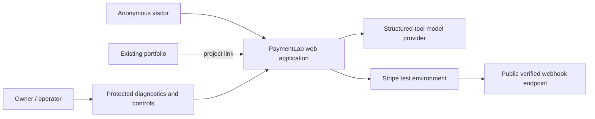
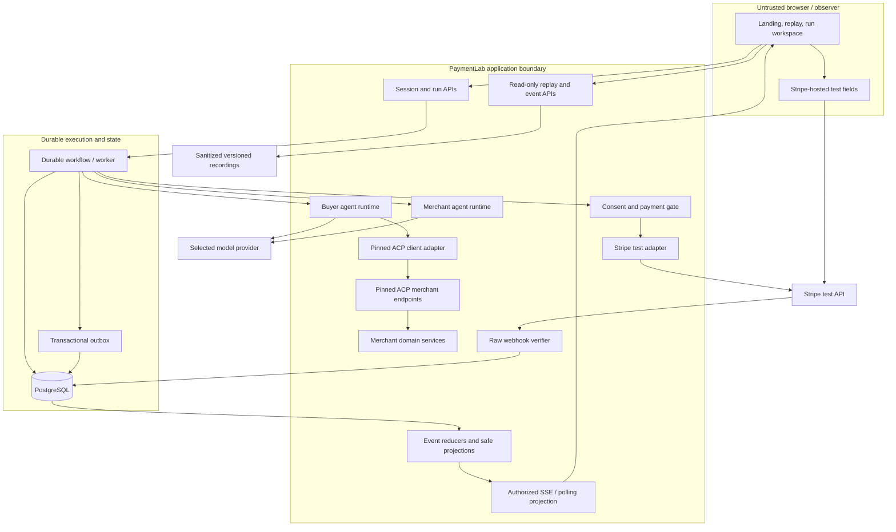
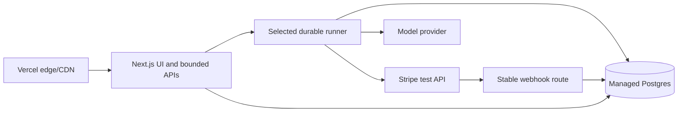

# Architecture

Status: proposed; Phase 0 decisions are intentionally unresolved.

## System context

The portfolio links to PaymentLab but is not part of its runtime. Phase 0 records
dated observations and proposals for the repository, Vercel project, database,
workflow provider, model provider, domain, and Stripe capability. Those records
must not be treated as current candidate evidence without fresh, authorized
verification and the applicable accepted ADRs.

## Proposed component architecture

### M3.1 evidence calibration

The diagrams below describe target topology, not a deployed candidate. Exact
candidate `b9a480c353a7123c4680aec3ed5b442c8ceaa821` verifies only the local
synthetic application, PostgreSQL, outbox, safety, webhook-composition, and
reconciliation boundaries. It does not establish a Stripe-capable account,
registered callback, hosted PostgreSQL, hosted runner, candidate-mapped staging
deployment, or accepted payment handler. Historical Vercel/Stripe observations in
the Phase 0 inventory are context only and must be freshly verified under an
approved external package before use as M3 evidence.

## Responsibility boundaries

| Component | Owns | Must not own or infer |
| --- | --- | --- |
| UI | Mission input, explicit confirmation/permission, projections, replay controls | Payment success, price truth, authority validity |
| Buyer agent | Evidence-based candidate selection and allowed ACP actions | Merchant cost data, new authority, raw payment credentials |
| Merchant agent | Conversation around server-returned merchant facts | Overriding price, inventory, risk, or order facts |
| Merchant services | Catalog, stock, quote, offers, reservation, merchant rules | Buyer mandate or provider-native payment truth |
| ACP adapter | Pinned wire contracts, auth, versions, domain mapping | Invented extensions or unverified payment compatibility |
| Consent/payment gate | Mandate validation/reservation and dispatch fencing | Silent amendments or release on unknown outcome |
| Stripe adapter | Test-mode provider operations, idempotency, safe references | Real-mode operation, order confirmation by itself |
| Webhook intake | Raw signature verification and durable receipt | Session authentication or immediate non-durable business effects |
| Workflow | Durable orchestration, waits, retries, recovery | Process-memory-only progress or browser-lifetime coupling |
| Event/projector layer | Ordered evidence, safe role/observer projections, replay snapshots | Secrets, reusable tokens, hidden model reasoning |

## Trust boundaries

1. Browser input, mission text, catalog descriptions, and agent messages are
   untrusted and schema-validated.
2. The browser receives only an opaque session and hosted-payment-safe client
   material. Server credentials and raw reusable payment tokens never enter it.
3. Buyer and Merchant agents have distinct prompts and tool allowlists even if
   they use the same model.
4. Human observer visibility across perspectives does not expand either agent's
   authority.
5. ACP calls are server-authenticated, run-scoped, and validated against a pinned
   schema in both directions.
6. Stripe callbacks cross a provider-authenticated boundary: verify the raw body
   before treating an event as trusted.
7. Public recordings cross a publication boundary and require irreversible
   sanitization/validation before release.

## Deployment shape

Vercel is the preferred UI/API host, not automatically the durable executor.
Phase 0 must prove whether Vercel Workflows is suitable and available or select a
persisted queue plus independently reliable worker. All pending payment
reconciliation must survive browser closure and bounded function termination.

## Architecture decisions required before implementation

| ADR | Status | Decision | Evidence still needed |
| --- | --- | --- | --- |
| [0001](decisions/0001-runtime-topology.md) | Proposed | Runtime/deployment topology | Callback reachability, database and environment separation |
| [0002](decisions/0002-acp-version.md) | Accepted | ACP revision and supported surface | PaymentLab generated-type/contract tests in Phase 2 |
| [0003](decisions/0003-stripe-payment-path.md) | Proposed; blocked | Stripe credential/payment-handler boundary | Supported owner-account test flow and tiny end-to-end spike |
| [0004](decisions/0004-durable-workflow.md) | Proposed | Durable workflow/outbox | Wait/retry/recovery proof, limits, operational ownership, cost |
| [0005](decisions/0005-model-provider.md) | Proposed | Model provider and structured-tool contract | Supported schemas, usage reporting, timeout/retry behavior, data policy |
| [0006](decisions/0006-event-projection-and-redaction.md) | Accepted for synthetic replay | Event schema and projection/redaction policy | Integrated-recording publication remains gated |
| [0008](decisions/0008-guided-replay-recording-contract.md) | Accepted for Milestone 1 | Checked-in synthetic recording and cursor projection | Integrated capture/sanitization remains out of scope |
| [0007](decisions/0007-database-and-orm.md) | Proposed | Neon Postgres and Prisma ORM | Authorized resource plus transaction/migration/restore proof |

## Growth seams, not MVP promises

The ACP adapter, payment adapter, event schema, and workflow steps should retain
clear interfaces for later payment operations or providers. The MVP must not
build unused service shells or imply that refunds, disputes, PayPal, routing, or
AP2 proof already work.

## Implemented Milestone 1 replay slice

The local Milestone 1 increment serves `/demo/[runId]` as a statically generated,
read-only route. `lib/replay/store.mjs` accepts only allowlisted checked-in
recordings labelled `synthetic_development_fixture`; `lib/replay/reducer.mjs`
derives every view from events at or before the selected cursor. The client
workspace imports neither the Stripe webhook route nor any future live adapter.
No database, workflow, model, Stripe, or other external credential is required.
