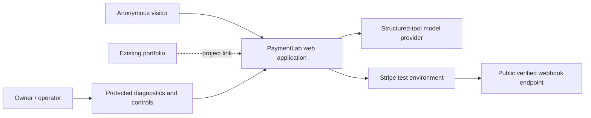
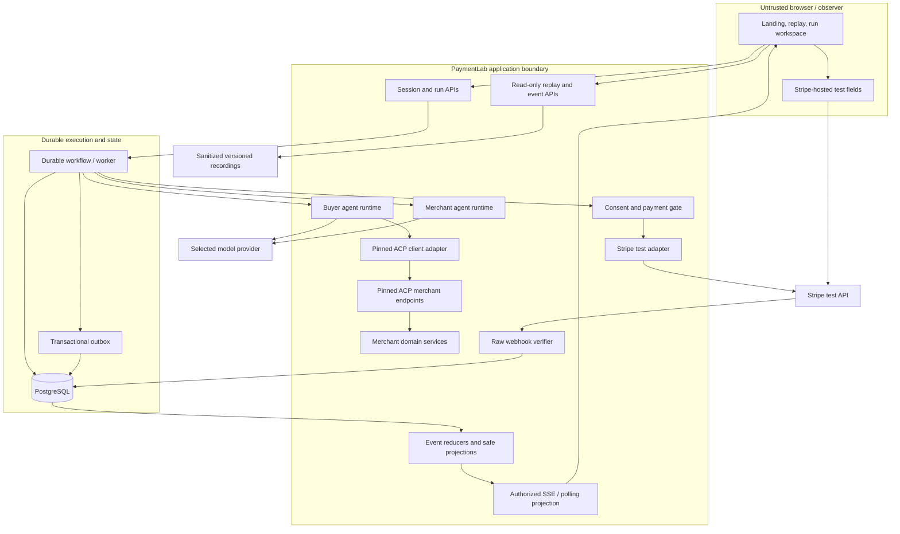
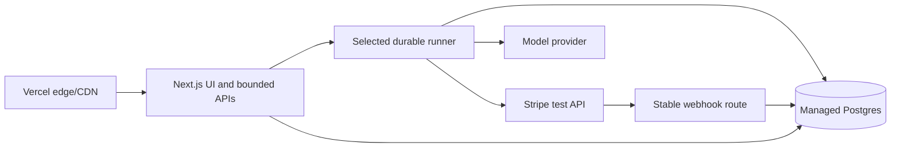

# Architecture

Status: proposed; Phase 0 decisions are intentionally unresolved.

## System context

The portfolio links to PaymentLab but is not part of its runtime. The exact
repository, Vercel project, database, workflow provider, model provider, domain,
and Stripe capability are verified in Phase 0 and captured in ADRs.

## Proposed component architecture

## Responsibility boundaries

| Component | Owns | Must not own or infer |
| --- | --- | --- |
| UI | Mission input, explicit confirmation/permission, projections, replay controls | Payment success, price truth, authority validity |
| Buyer agent | Evidence-based candidate selection and allowed ACP actions | Merchant cost data, new authority, raw payment credentials |
| Merchant agent | Conversation around server-returned merchant facts | Overriding price, inventory, risk, or order facts |
| Merchant services | Catalog, stock, quote, offers, reservation, merchant rules | Buyer mandate or provider-native payment truth |
| ACP adapter | Pinned wire contracts, auth, versions, domain mapping | Invented extensions or unverified payment compatibility |
| Consent/payment gate | Mandate validation/reservation and dispatch fencing | Silent amendments or release on unknown outcome |
| Stripe adapter | Test-mode provider operations, idempotency, safe references | Real-mode operation, order confirmation by itself |
| Webhook intake | Raw signature verification and durable receipt | Session authentication or immediate non-durable business effects |
| Workflow | Durable orchestration, waits, retries, recovery | Process-memory-only progress or browser-lifetime coupling |
| Event/projector layer | Ordered evidence, safe role/observer projections, replay snapshots | Secrets, reusable tokens, hidden model reasoning |

## Trust boundaries

1. Browser input, mission text, catalog descriptions, and agent messages are
   untrusted and schema-validated.
2. The browser receives only an opaque session and hosted-payment-safe client
   material. Server credentials and raw reusable payment tokens never enter it.
3. Buyer and Merchant agents have distinct prompts and tool allowlists even if
   they use the same model.
4. Human observer visibility across perspectives does not expand either agent's
   authority.
5. ACP calls are server-authenticated, run-scoped, and validated against a pinned
   schema in both directions.
6. Stripe callbacks cross a provider-authenticated boundary: verify the raw body
   before treating an event as trusted.
7. Public recordings cross a publication boundary and require irreversible
   sanitization/validation before release.

## Deployment shape

Vercel is the preferred UI/API host, not automatically the durable executor.
Phase 0 must prove whether Vercel Workflows is suitable and available or select a
persisted queue plus independently reliable worker. All pending payment
reconciliation must survive browser closure and bounded function termination.

## Architecture decisions required before implementation

| ADR | Decision | Evidence needed |
| --- | --- | --- |
| 001 | Runtime/deployment topology | Actual Vercel scope, callback reachability, database and environment separation |
| 002 | ACP revision and supported surface | Release/schema hash, license, contract tests, capability negotiation |
| 003 | Stripe credential/payment-handler boundary | Supported owner-account test flow and tiny end-to-end spike |
| 004 | Durable workflow/outbox | Wait/retry/recovery proof, limits, operational ownership, cost |
| 005 | Model provider and structured-tool contract | Supported schemas, usage reporting, timeout/retry behavior, data policy |
| 006 | Event schema and projection/redaction policy | Replay compatibility, observer roles, safe evidence examples |

## Growth seams, not MVP promises

The ACP adapter, payment adapter, event schema, and workflow steps should retain
clear interfaces for later payment operations or providers. The MVP must not
build unused service shells or imply that refunds, disputes, PayPal, routing, or
AP2 proof already work.
