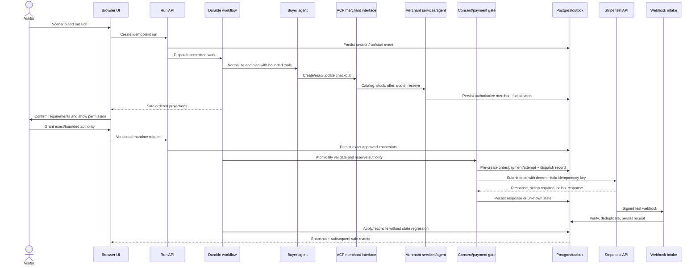
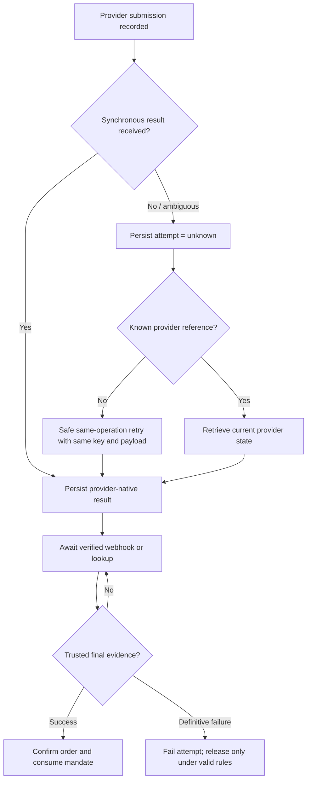
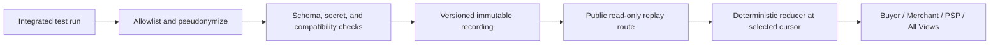

# Data flows

Status: proposed from PRD version 1.0.

## Live purchase and evidence flow



The database commit is the synchronization point. Browser displays, model text,
and success redirects are not payment evidence. Every mutating provider operation
has a stable internal operation ID, deterministic provider idempotency key,
request hash, and associated result.

## Unknown-outcome recovery



An HTTP timeout, browser refresh, tab closure, or worker lease expiry never
creates a new attempt or releases a reserved mandate while the outcome is
unknown.

## Webhook path

1. Receive the raw request at a stable public endpoint.
2. Verify the endpoint-specific signature and tolerance before trusted parsing.
3. Persist the provider event ID and minimized payload transactionally.
4. Return failure if durable receipt fails so Stripe can retry.
5. Enqueue/apply asynchronously and idempotently.
6. Match pre-created attempt/payment records using trusted provider metadata.
7. Ignore duplicate business effects; do not regress terminal state on
   out-of-order events.
8. Project a redacted evidence event for authorized viewers.

## Guided Replay data flow



Before integrated recordings exist, fixtures follow the same schema but carry a
`synthetic_development_fixture` source label. Replay infrastructure has no
credentials or dependency on the live agent/payment mutation path.

## Data classification and projection

| Class | Examples | Storage/display rule |
| --- | --- | --- |
| Public replay | Fictional products, sanitized event summaries, safe pseudonyms | Versioned immutable asset after publication validation |
| Session-scoped | Mission, normalized constraints, run events, safe provider refs | Authorized session only; expire live detail by policy |
| Merchant-private | Cost, margin, offer/risk-rule inputs | Merchant agent/tools and authorized human observer projection only |
| Provider-sensitive | Client secret, raw credential/token, full provider payload | Minimize; trusted backend only; never event stream or model |
| Secret | API keys, webhook secrets, bearer credentials, session secret | Secret store only; never logs, docs, recordings, or database plaintext |
| Operational audit | Idempotency key association, request hash, webhook ID, reconciliation state | Restricted diagnostics; retain minimally until outcome resolved |

## Retention and deletion

Live run detail and transcripts expire after the configured default period
(proposed seven days). Sanitized recordings are separately reviewed durable
assets. Deletion cannot orphan a submitted or unknown payment: retain the minimum
attempt, provider reference, mandate reservation, webhook, and reconciliation
state until resolved. Provider-side test records follow provider retention and
are not erased by local cleanup.

## Implemented synthetic replay flow

1. `generateStaticParams` asks the server-only recording store for its allowlisted
   fixture slugs.
2. The store loads and validates `public/replays/synthetic-success-v1.json`.
3. The browser receives only that checked-in synthetic recording.
4. For cursor `n`, the reducer considers only events whose sequence is `<= n`.
5. Known event patches update Buyer, Merchant, PSP, and shared projections.
   Unknown event types remain visible timeline facts but cannot mutate a view.
6. Seeking or rewinding recomputes the projection from the immutable baseline;
   it does not reverse a workflow or call an external system.

The fixture contains no callback secret, reusable credential, PAN, or live
customer data. Its provider-shaped reference begins `pi_demo_` and is not a
Stripe object.

## Milestone 2 transaction and migration flow

Callers obtain a transaction with `withTransaction(work)` and pass its scoped
client to persistence operations. A business mutation, `appendDomainEvent`, and
`createOutboxJob` commit together or all roll back. Event sequence allocation
updates the owning `(session_id, run_id)` row before insert, so cross-session
access fails closed and concurrent committed writers remain contiguous.

The local evidence harness creates a uniquely named disposable database inside
`paymentlab-postgres`, applies migration `202609180001_m2_persistence_foundation`
twice, inspects constraints and indexes, exercises transaction rollback and
concurrent writers, rehearses the down/up cycle in a second disposable database,
and drops both databases. It reads the container's configured PostgreSQL user and
database names inside the container and never exposes credentials.

Run focused evidence with:

```text
node --test test/m2-data-*.test.mjs
```

No hosted resource, provider call, credential, webhook destination, payment, or
background dispatcher is created by this flow.

## Milestone 3 local safety and scoped repository flow

The M3 persistence adapter adds these transaction-scoped envelopes:

- `readSafetyControl(tx,{environment})` returns
  `{paymentAdmissionEnabled,version,reasonCode}` and defaults missing controls to
  disabled.
- `setSafetyControl(tx,{environment,paymentAdmissionEnabled,expectedVersion,reasonCode})`
  returns `{status:"updated",record}` or `{status:"conflict"}`.
- `reserveSyntheticBudget(tx,claim)` returns one of `reserved`, `replay`,
  `conflict`, `kill_switch`, or `budget_exhausted`; successful/replayed results
  may include their durable admission record.
- `upsertReconciliationControl`, `readReconciliationControl`, and
  `updateReconciliationControl` always require session, run, and attempt scope.
- `claimAcpIdempotency`, `storeAcpIdempotentResponse`, `createAcpCheckout`,
  `retrieveAcpCheckout`, `updateAcpCheckout`, and
  `cancelAcpCheckout` always require both `sessionId` and `runId`. Create returns
  `created`; reads return `found` or `not_found`; updates/cancel return their
  mutation status or `not_found`. ACP idempotency returns `created`, `replay`,
  `conflict`, or a fail-closed pending/forbidden result.

New admission flows as: lock scoped run, resolve stable replay/conflict, read the
environment kill switch, lock the in-window scoped policy/counter, conditionally
reserve integer count/amount, and persist the decision in one transaction.
Reconciliation does not traverse this admission gate. ACP checkout CRUD uses the
existing M2 checkout record and owner-qualified predicates, while complete and
delegate-payment remain outside this repository and hard-blocked elsewhere.

Focused evidence runs with:

```text
node --test test/m3-data-*.test.mjs
```

The harness applies M2 then M3 migrations inside uniquely named disposable
databases in the existing local container, repeats M3 apply, inspects schema,
rehearses M3 down/reapply while preserving M2 tables, and drops every disposable
database. It uses the container-configured PostgreSQL role without printing it.
