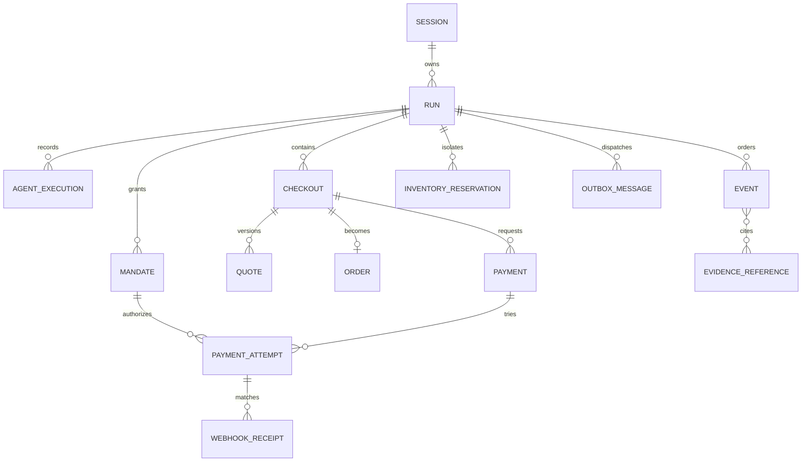

# Data model and invariants

Status: logical model proposed; Neon Postgres and Prisma ORM are proposed in
[ADR-0007](decisions/0007-database-and-orm.md), pending a resource spike.

## Core relationships

## Record purpose

| Record | Minimum responsibility |
| --- | --- |
| Session | Opaque identity, admission counters, expiry, no registration profile |
| Run | Mode, scenario, phase/state, reference clock, ownership, limits, versions |
| Agent execution | Role, model/prompt/schema versions, usage, safe outcome; no hidden reasoning |
| Checkout | Pinned ACP version, native/internal states, cart version/hash, quote reference |
| Quote | Immutable money breakdown, shipping, illustrative tax, expiry, assumptions |
| Mandate | Exact approved text/normalized constraints, version, scope, expiry, revocation, state |
| Inventory reservation | Run-local stock, version, fencing/lease, expiry, unknown-payment hold |
| Order | Stable pre-provider ID, fulfillment simulation state, confirmed evidence source |
| Payment | Stable commerce payment identity and provider-safe reference |
| Payment attempt | Stable attempt, operation keys/hashes, internal/native status, reconciliation |
| Webhook receipt | Provider event uniqueness, verification/application status, safe payload |
| Event | Per-run sequence, timestamps, actor/source, safe data, evidence references, schema version |
| Outbox message | Transactionally committed work awaiting durable dispatch |

## Separate state dimensions

Do not collapse these into one status:

- Run: `queued`, `running`, `awaiting_permission`,
  `awaiting_authentication`, `awaiting_payment`, `succeeded`, `blocked`,
  `failed`, `canceled`, `expired`.
- Checkout: `draft`, `quoted`, `ready`, `completing`, `completed`, `canceled`,
  `expired`, explicitly mapped to the pinned ACP revision.
- Mandate: `draft`, `active`, `reserved`, `consumed`, with terminal
  `expired`/`revoked` alternatives where legally reachable.
- Attempt: `prepared`, `submitted`, `requires_action`, `processing`,
  `succeeded`, `failed`, `canceled`, `unknown`.
- Order: `pending_payment`, `confirmed`, `payment_failed`, `canceled`.
- Webhook: `received`, `verified`, `applied`, `duplicate`, `rejected`,
  `retry_pending`.

Provider-native states are stored separately from internal states.

## Hard invariants

1. Money is integer minor units; rates use integer basis points or rational
   arithmetic; rounding occurs at the documented boundary.
2. A run is accessible only by its owning opaque session, except versioned public
   recordings.
3. Inventory is isolated by live run and guarded by reservation version/expiry.
4. An exact mandate binds to immutable merchant/cart/currency/amount/shipping/
   payment-reference data; a material change invalidates it.
5. A bounded mandate cannot be expanded by an agent and allows at most one
   successful purchase.
6. Authority validation, reservation, and payment-dispatch fencing are atomic.
7. There is at most one active attempt per checkout and at most one successful
   payment per one-purchase mandate.
8. Stable records exist before provider submission; retries of one operation use
   the same key and payload hash.
9. Unknown outcomes keep the mandate and inventory reserved until reconciled.
10. Only a verified webhook or documented server-side provider lookup can confirm
    an order; model/UI assertions cannot.
11. Provider event ID is unique; applying the same webhook twice has one business
    effect; out-of-order events cannot regress terminal state.
12. Event sequence is monotonically assigned per run and reducer application is
    deterministic and idempotent.
13. Secrets, full credentials, PAN/CVV, reusable tokens, and hidden model
    reasoning are absent from events, recordings, and agent context.

## Migration rules

Migrations are explicit, reviewable, and backward-compatible with the currently
deployed code during rollout. Event schema changes are versioned; older replay
renderers tolerate unknown event types. Destructive cleanup is a separate,
observable retention job and cannot remove unresolved reconciliation records.

## Implemented Milestone 1 domain subset

The replay foundation implements six independent transition tables: `run`,
`checkout`, `mandate`, `attempt`, `order`, and `webhook`. Illegal or regressive
transitions fail closed. Money uses integer USD minor units and basis-point
multiplication rounded half up; the reference fixture verifies `$303.19` total,
`$9.09` illustrative processor fee, and `$69.91` contribution.

Recording schema `1.0.0` requires a contiguous increasing sequence, unique event
IDs, ordered timestamps within the declared duration, summaries,
explanations/evidence references, typed allowlisted projection patches, a
validated fictional catalog, and the source label
`synthetic_development_fixture`. The checked-in
store intentionally rejects integrated/live recording labels until a later
publication gate exists.

## Implemented Milestone 2 persistence foundation

Migration `202609180001_m2_persistence_foundation` is additive and provider-neutral
PostgreSQL 16 SQL under `db/migrations/`. It creates the session/run, checkout,
quote, mandate/use, order, payment/attempt, webhook receipt, domain event, outbox,
idempotency, reconciliation, and admission-usage records required by M2.

Ownership is enforced by composite session/run foreign keys and every adapter
lookup requires both the session and opaque resource ID. Monetary columns are
`bigint` minor units. Partial unique indexes enforce one active payment attempt
per checkout and one successful use per mandate. Provider event and outbox dedupe
keys are unique. Provider references are unique only when both provider and
reference are present, allowing multiple not-yet-submitted provider-neutral
payments. Idempotency identity/request hashes are immutable after insert. Outbox
leases carry owner, token, and expiry fencing fields; expired work at its retry
limit becomes observably `dead` rather than remaining permanently leased.

`append_domain_event` advances a locked run row and inserts the event in the
caller's transaction, producing gap-free committed per-run sequences even under
concurrency. Event schema versions remain explicit; existing recording schema
`1.0.0` and its unknown-event behavior are unchanged.

The down migration is a destructive rehearsal aid for uniquely named disposable
test databases only. Operational rollback disables callers while retaining this
additive schema and unresolved records.

## Implemented Milestone 3 local safety controls

Migration `202609190001_m3_local_safety_controls` adds six provider-neutral
PostgreSQL records without changing M2 data: environment safety controls, scoped
budget policies, locked budget counters, stable admission decisions, and durable
reconciliation controls, plus owner-scoped ACP checkout documents. It implements the bounded local contract from
`M3.1-readiness`; the owner artifact remains outside this specialist branch.

Safety-control rows default payment admission to false and use a monotonic
optimistic version. A missing row is interpreted as
`{paymentAdmissionEnabled:false,version:0,reasonCode:"missing_control"}`. Budget
windows are UTC `timestamptz` ranges. Amount ceilings and consumption are
integer `bigint` minor units; attempt ceilings and counters are integers.

`reserve_synthetic_budget` locks the owner-qualified run before replay and
reservation checks, then locks the selected policy/counter. Concurrent claims
cannot advance count or amount beyond either ceiling. Admission identity is
unique by both `(session,run,operation)` and `(session,run,attempt)`. An exact
replay of a reservation returns `replay`; an exact replay of a denied decision
returns its original `kill_switch` or `budget_exhausted` status so consumers can
never treat denial as admission. Changed hash, amount, policy, environment, or
identity returns `conflict`. Denied decisions consume no budget.

Reconciliation controls reference an existing owner-qualified attempt and are
not gated by the admission control. Turning the kill switch off therefore blocks
new reservations without making an already-unknown attempt unreadable or
unresolvable. The down migration is disposable-test-only; operational rollback
preserves all safety, admission, attempt, receipt, and reconciliation records.
