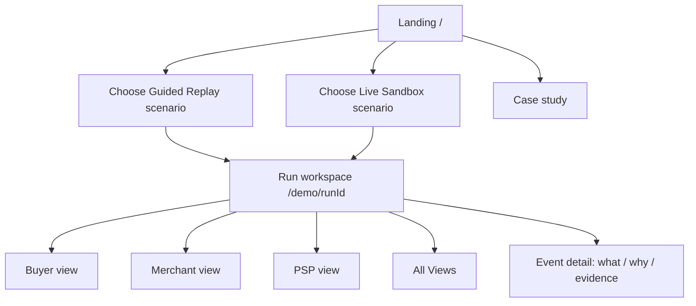
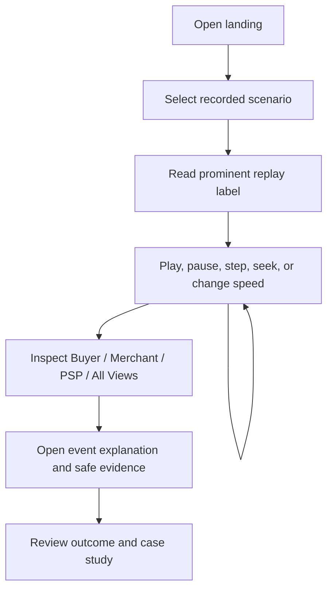
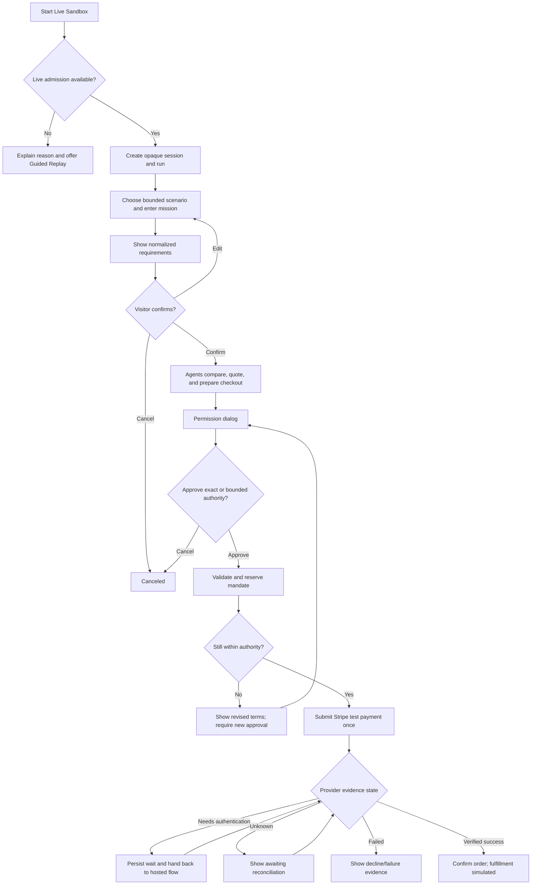

# Experience and design flows

Status: proposed from PRD version 1.0.

## Shared information architecture

Every perspective reads the same persisted transaction history at the same event
cursor. Perspective switching changes the authorized projection, not the
underlying facts.

## Guided Replay flow

Design requirements:

- Label release recordings as sanitized integrated test runs; label development
  fixtures as synthetic until such recordings exist.
- Rewinding reconstructs the historical snapshot and cannot reveal future facts.
- Speed-up discloses accelerated presentation while retaining actual timings.
- Replay has no path to model, ACP, Stripe, webhook, or live-workflow mutation.

## Live Sandbox flow

## Permission interaction

The permission dialog shows the merchant, exact cart or bounded criteria,
all-in limit, currency, resolved delivery date, safe payment reference, expiry,
and one-purchase scope. Delegation is never preselected.

Exact approval binds to an immutable cart/version/hash. Bounded delegation binds
to normalized constraints. Any material change returns the user to a fresh
permission decision. The UI must distinguish:

- setup consent from purchase authority;
- application authority from provider/issuer authentication;
- submission from provider response;
- provider response from verified confirmation;
- unknown from failed;
- display pause/rewind from workflow or transaction reversal.

## Workspace behavior

The header shows mode, scenario, abbreviated run ID, phase, provider environment,
and connection state. The journey bar is:

`Mission -> Compare -> Quote -> Permission -> Payment -> Confirmation`

The event rail is persistent and ordered by server sequence. Its drawer answers
“What happened?”, “Why it matters”, and “Evidence”. Technical JSON is collapsed
by default. Desktop All Views uses three columns; narrow layouts stack without
requiring horizontal scrolling for core content.

## End-state copy contract

| State | Required message principle |
| --- | --- |
| Success | Provider-backed confirmation; “Order confirmed; fulfillment simulated/not performed” |
| Blocked | State the violated authority or unsupported request; do not imply a PSP call occurred |
| Awaiting reconciliation | Explain that submission may have occurred and another payment will not be started |
| Declined/failed | Distinguish a definitive provider result from a transport or display error |
| Canceled | Explain whether cancellation occurred before or after submission |
| Expired/revoked | State that future action is blocked; do not promise reversal after dispatch |

Never say funds settled, goods shipped, or fulfillment completed.

## Accessibility checkpoints

- Full replay and permission flow with keyboard only.
- Visible focus, semantic headings/tables/dialogs, WCAG AA contrast, and status
  conveyed by text as well as color.
- Screen-reader announcements for meaningful committed state changes without
  reading an invented continuous stream.
- Reduced-motion mode; animations represent actual state changes.
- Auto-scroll stops when the visitor inspects earlier evidence.
- A phone viewport can complete Guided Replay and the permission decision.

## Implemented Guided Replay interaction

The landing page opens the allowlisted successful fixture. The workspace keeps
the run label, synthetic-only boundary, phase, state, and cursor visible; offers
Buyer, Merchant, Provider, and synchronized All Views tabs; and provides an
ordered event rail, evidence details, first/previous/play/next controls, a range
scrubber, and three playback speeds. Selecting an event pauses playback.

Future rail entries are not rendered; summaries, event types, and derived
provider facts appear only after the cursor reaches them. At phone width,
panels stack and controls remain available
without document-level horizontal overflow. Buttons, tabs, range, and select
controls use native keyboard semantics, visible focus, labels, and text status.
No motion is required to interpret a state change.
