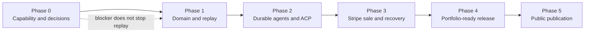

# PaymentLab AI MVP implementation plan

Status: proposed
Source of scope: `PaymentLab-AI-MVP-PRD.html`, version 1.0
Delivery strategy: gated vertical slices, replay first, live payment last

## Outcome and release boundary

The MVP is a public, portfolio-linked sandbox showing one agent-led sale from
three synchronized perspectives: Buyer, Merchant, and PSP. It has two honestly
separated modes:

- **Guided Replay** is public, reliable, read-only, and never invokes agents or
  payment mutations.
- **Live Sandbox** runs bounded Buyer and Merchant agents and can create a real
  Stripe test-mode sale only after explicit, auditable purchase authority.

The MVP is sale-only, USD-only, quantity-one, one fictional merchant, six
fictional products, one synthetic shipping profile, and one enabled test PSP.
Refunds, disputes, real fulfillment, real money, multi-PSP routing, marketplace
payouts, subscriptions, autonomous web shopping, and production identities stay
out of scope.

## Delivery principles

1. Correctness and evidence precede polish.
2. A small end-to-end slice is preferred to disconnected service scaffolding.
3. Server-side domain rules, not model text, determine price, stock, authority,
   payment, and order state.
4. Unknown payment outcomes are reconciled; they are never converted to failure
   merely to simplify the UI.
5. Every phase has a runnable outcome, an explicit gate, and updated documents.
6. Calendar estimates are created only after Phase 0 resolves capability and
   ownership facts. Until then, sequence is committed but dates are not.

## Roadmap at a glance

| Phase | Demonstrable increment | Hard exit gate |
| --- | --- | --- |
| 0. Capability and decisions | Minimal supported Stripe test payment/callback and verified platform inventory, or a documented payment blocker | Protocol/payment path and deployment architecture decided; replay may proceed if live is blocked |
| 1. Domain and replay | Full successful scenario from synthetic events in Buyer, Merchant, PSP, and All Views | Deterministic economics/state/replay tests and responsive accessibility review pass |
| 2. Durable agents and ACP | Live agents reach a validated checkout and pause at authority, with no payment dispatch | Agent/tool isolation, durable wait/resume, ACP contract tests, and no-payment boundary pass |
| 3. Stripe sale and recovery | One authorized Stripe test sale plus consent-block and uncertain-response scenarios | Exactly-once business effect, verified evidence, webhook, crash, duplicate, and ordering tests pass |
| 4. Portfolio-ready release | Preview deployment with sanitized recordings, metrics, case study, controls, and runbook | A01-A28 resolved; preview smoke, security, privacy, and accessibility reviews pass |
| 5. Public publication | Stable public replay and explicitly enabled live sandbox linked from the portfolio | DNS/TLS/callback/rollback checks pass and owner authorizes publication |

## Phase 0 — capability and architecture decisions

### Objective

Remove the decisions that could invalidate the live design before building it.
This is discovery with executable evidence, not an infrastructure build-out.

### Work packages

- Inventory the repository, portfolio repository, Vercel owner/project scope,
  available Postgres, durable workflow options, Stripe test account, model
  provider, and relevant usage limits.
- Pin an ACP release, schema commit/hash, license, supported operations, version
  header behavior, and authentication model.
- Test the actual Stripe credential/delegation path available to the owner.
- Make one minimal supported Stripe test payment and receive a signature-verified
  callback in an isolated development endpoint.
- Select the durable workflow approach. Verify durable waits, retries, webhook
  wake-up or polling, deployment compatibility, and operating cost/limits.
- Decide the typed ORM, model provider, event-stream transport, redaction policy,
  environment separation, and repository/deployment relationship.
- Threat-model the session, agent/tool, ACP, payment, webhook, evidence, and
  observer-projection boundaries.

### Deliverables

- ADR-001 deployment/runtime architecture.
- ADR-002 pinned ACP revision and compatibility boundary.
- ADR-003 Stripe test credential and payment-handler path.
- ADR-004 durable workflow/outbox choice.
- `docs/acp-compatibility.md` populated with verified results.
- Environment inventory containing identifiers and limits but no secrets.
- Capability-spike test notes with safe provider references.
- Initial estimates and capacity plan for Phases 1-5.

### Exit gate

Pass when the payment/callback spike succeeds and the four decisions are
accepted. If a compatible ACP payment handler is unavailable, explicitly choose
either the PRD-permitted custom Stripe completion boundary with accurate labeling
or mark Live Sandbox blocked. Guided Replay work can continue in either case.

## Phase 1 — domain and Guided Replay foundation

### Objective

Deliver the complete five-minute story without external mutations, using the
same domain vocabulary and event projections intended for live runs.

### Work packages

- Scaffold the selected Next.js/TypeScript application and quality gates.
- Implement integer-minor-unit money, rational/basis-point calculations, the
  six-product catalog, inventory isolation, quote/reservation rules, and the
  exact `$303.19 / $9.09 / $69.91` fixture.
- Define separate run, checkout, mandate, attempt, order, and webhook state
  machines and illegal transitions.
- Define the versioned event envelope, deterministic reducers, snapshots,
  explanations, evidence references, and unknown-event compatibility behavior.
- Build landing, journey bar, event rail/drawer, perspective tabs, Buyer,
  Merchant, PSP, and responsive All Views.
- Implement the public read-only replay manifest/event routes, cursor controls,
  backward seeking, speed controls, and synthetic-fixture labeling.
- Add keyboard, focus, screen-reader, reduced-motion, and mobile behavior early.

### Tests and evidence

- Unit: money, quote, mandate predicates, state transitions, reducers.
- Contract: recording schema and version compatibility.
- Browser: replay mutation isolation, cursor consistency, perspective switching,
  mobile journey, keyboard use, and reduced motion.
- Visual review: all required cards and real/simulated labels.

### Exit gate

A user can complete the successful Guided Replay story across every perspective;
no future event leaks during rewind; replay routes cannot invoke live code;
economics are exact; Phase 1 traceability rows have repeatable evidence.

## Phase 2 — durable workflow, agents, and ACP checkout

### Objective

Run real bounded agents through catalog, comparison, offer, quote, and ACP
checkout, then durably pause at the purchase-authority boundary without any PSP
submission.

### Work packages

- Implement opaque sessions, run ownership, admission counters, one active run,
  CSRF/origin checks, idempotent run creation, reconnect, and expiration.
- Implement the durable workflow, transactional outbox, per-run event sequence,
  retry policy, leases/fencing, and resumable permission wait.
- Create separately versioned Buyer and Merchant prompts, structured outputs,
  evidence IDs, fixed tool allowlists, server validation, and model budgets.
- Implement merchant catalog/stock/offer/quote/reservation services.
- Implement the pinned ACP server surface, client adapter, generated types,
  authentication, run scoping, version mapping, and contract tests.
- Implement mission normalization plus explicit user confirmation.
- Implement exact-purchase and bounded-delegation grant, revision, expiry,
  revocation, reservation, and validation—stopping before payment dispatch.
- Stream committed events through SSE with cursor catch-up and polling fallback.

### Tests and evidence

- Integration: ownership isolation, admission races, outbox recovery, worker
  restart, stale reservation, concurrent grants, permission wait/resume.
- Agent: prompt-injection attempts, role/tool isolation, invalid arguments,
  unsupported missions, model timeout, and budget exhaustion.
- ACP: request/response schemas, version headers, auth, errors, idempotency, and
  advertised-capability accuracy.

### Exit gate

An authorized session can run both agents to a server-validated, reserved,
versioned checkout; the workflow pauses durably for permission; no code path in
this phase can dispatch a payment; ACP compatibility claims match verified tests.

## Phase 3 — Stripe test sale and resilient recovery

### Objective

Complete one authorized test-mode sale while proving the negative and ambiguous
paths that make the result trustworthy.

### Work packages

- Add Stripe-hosted test payment setup with explicit setup consent and safe
  backend-held references.
- Reserve mandate authority atomically with stable order/payment/attempt records
  before provider submission.
- Implement automatic-capture submission with per-operation deterministic
  idempotency keys and request-hash conflict detection.
- Verify and durably record raw-body webhooks; deduplicate, apply asynchronously,
  tolerate out-of-order delivery, and match callbacks that beat API responses.
- Implement `unknown`, reconciliation by known provider reference or safe same-key
  retry, retry horizon, manual diagnostics, and unresolved-state UI.
- Add server-controlled, allowlisted uncertain-response injection after a real
  Stripe test mutation.
- Keep kill switch and exhausted budgets from stopping reconciliation of already
  submitted attempts.

### Tests and evidence

- Public scenarios: successful delegated sale, consent boundary, uncertain
  response.
- Integration: concurrent completion, browser refresh, duplicate callback,
  invalid signature, callback-before-response, out-of-order events, worker crash,
  request-hash conflict, and provider authentication state.
- Smoke: isolated real Stripe test sale using the deployed callback configuration.

### Exit gate

There is exactly one successful payment and one confirmed order for one mandate;
no invalid authority reaches Stripe; unknown outcomes reconcile without a new
attempt; confirmation is grounded in webhook or provider lookup evidence.

## Phase 4 — portfolio-ready release

### Objective

Turn the working system into a safe, legible, measurable preview release.

### Work packages

- Capture successful, blocked, and uncertain integrated runs; sanitize, version,
  validate, and replace synthetic release fixtures.
- Add metrics with population, sample size, source, measurement conditions, and
  replay/live separation.
- Add case study, limitations, ACP compatibility label, architecture summary,
  and explicit independent-sandbox attribution.
- Finish persisted limits, kill switch, cleanup/retention, unresolved-attempt
  diagnostics, secret rotation, health checks, security headers, and CSP.
- Complete the README, environment guide, migrations, local webhook testing,
  deployment runbook, incident/rollback steps, and portfolio-card proposal.
- Test accessibility, responsive layout, performance, redaction, and recording
  compatibility on the preview deployment.

### Exit gate

All A01-A28 checks are pass, intentionally deferred with PRD-consistent rationale,
or blocked with an owner decision. Compatibility and simulation labels are true;
the preview callback works; rollback to replay-only is rehearsed.

## Phase 5 — controlled public publication

### Objective

Publish the verified preview without changing unrelated portfolio or DNS assets.

### Work packages

- Obtain owner approval for the final release, live-admission setting, domain,
  portfolio change, and actual operating limits.
- Promote the compatible build and migrations in the verified Vercel scope.
- Configure only the Vercel-provided demo subdomain records; preserve apex,
  `www`, email, verification, and unrelated records.
- Configure and verify the stable Stripe test webhook endpoint.
- Test public replay, authorized live access, session isolation, TLS, DNS,
  streaming/poll fallback, metrics labels, and case-study/source links.
- Monitor first runs and retain replay-only rollback while pending payments finish
  reconciliation.

### Exit gate

The public journey passes the release smoke suite, operating controls are active,
there are no unresolved launch-critical attempts, and the owner has approved the
portfolio link. Publication is never inferred from completion of Phase 4.

## Cross-phase workstreams

| Workstream | Starts | Continues through | Non-negotiable outcome |
| --- | --- | --- | --- |
| Domain correctness | 1 | 5 | Integer money and explicit independent states |
| Security/privacy | 0 | 5 | Least privilege, session isolation, test-only PSP, redacted evidence |
| Reliability | 0 | 5 | Durable waits/outbox, idempotency, recovery, rollback |
| Experience/accessibility | 1 | 5 | Shared facts across perspectives; keyboard/mobile/reduced motion |
| Protocol compatibility | 0 | 5 | Pinned ACP contracts and accurate capability labels |
| Verification | 0 | 5 | A01-A28 traceability with repeatable evidence |
| Operations/cost | 0 | 5 | Limits, observability, retention, kill switch, honest cost claims |

## Change control

Scope changes are evaluated against the MVP boundary and the acceptance matrix.
A change that affects money, authority, protocol compatibility, payment state,
evidence, privacy, or deployment boundaries requires an ADR. Adding work to a
phase requires identifying the displaced work or changing the exit decision; a
date must not be preserved by silently weakening a hard gate.
