# PaymentLab AI threat model

Status: initial Phase 0 model; review after each capability spike.

## Security objectives

1. No real-money operation can run.
2. No payment is submitted without current, explicit, bounded application authority.
3. One-purchase authority cannot cause more than one successful payment.
4. Provider ambiguity cannot trigger a new attempt or false order confirmation.
5. Anonymous sessions cannot read or control another session's runs.
6. Agent or seller text cannot expand tools, authority, price, or destinations.
7. Secrets, reusable credentials, private merchant data, and personal data do not
   enter model context, public projections, logs, or recordings.
8. Cost and resource abuse fail safely while submitted payments still reconcile.

## Assets

- Mandates and their exact normalized constraints.
- Checkout, quote, inventory, attempt, payment, order, and reconciliation state.
- Stripe test credentials, webhook secrets, and safe provider references.
- ACP bearer credentials and pinned schemas.
- Session cookies and run ownership.
- Buyer/Merchant prompts, tool policies, model budgets, and execution records.
- Merchant-private cost/margin information.
- Event/evidence history, live transcripts, and sanitized recordings.
- Vercel, database, workflow, model, and GitHub account resources and budgets.

## Trust boundaries

```mermaid
flowchart LR
    Internet["Anonymous internet"] --> Browser["Untrusted browser input"]
    Browser --> Session["Session/run API boundary"]
    Session --> Workflow["Durable workflow"]
    Workflow --> Agents["Untrusted probabilistic model output"]
    Agents --> Tools["Role-scoped validated tools"]
    Tools --> Gate["Deterministic authority/payment gate"]
    Gate --> Stripe["Stripe test API"]
    Stripe --> Hook["Signature-verified webhook boundary"]
    Hook --> DB[("Trusted persisted state")]
    DB --> Projection["Role-aware redaction/projection"]
    Projection --> Browser
    DB --> Sanitizer["Publication sanitizer"]
    Sanitizer --> Public["Public replay assets"]
```

## Threats and required controls

| Threat | Example | Required preventive/detective controls | Validation |
| --- | --- | --- | --- |
| Cross-session access | Session B guesses run A ID | Opaque IDs, ownership check on every route/stream/evidence lookup, no existence leak | A19 integration |
| CSRF/session fixation | Third-party origin grants/revokes mandate | HttpOnly Secure SameSite cookie, rotation, origin/CSRF checks, short expiry | Route security tests |
| Prompt injection | Product text says ignore budget | Treat content as data, fixed system rules/tools, schema validation, deterministic mandate gate | A21 adversarial tests |
| Tool/role escalation | Buyer asks for merchant costs or raw PSP token | Separate prompts and allowlists, role/run context checked server-side, redacted results | Agent authorization tests |
| Price/cart tampering | Browser/model changes total | Server-owned catalog and quote, immutable versions/hashes, recompute before dispatch | A04/A07/A08 |
| Double spend | Tabs/workers complete simultaneously | Atomic mandate reservation, fencing token, unique constraints, stable attempt, provider idempotency | A11/A12 |
| Ambiguous provider result | Timeout interpreted as decline and retried | Persist `unknown`, hold authority/inventory, same-key recovery/lookup, no new attempt | A13 |
| Forged/duplicate webhook | Fake success or repeated event | Raw-body signature verification, event-ID uniqueness, durable receipt, idempotent apply | A14/A15 |
| Out-of-order evidence | Older failure regresses success | Provider-native state retained, monotonic transition rules, lookup when ambiguous | A16 |
| False confirmation | Model or redirect says paid | Order confirmation only from verified webhook or server-side provider lookup | A17 |
| SSRF/open redirect | Mission contains callback URL | Configured allowlisted origins/hosts only; never fetch mission URLs | Security tests |
| Secret leakage | Key appears in event/model/log | Secret store, typed redaction/allowlists, no raw payload default, automated secret scan | A22 |
| Replay leakage | Recording contains token/transcript/private costs | Allowlist sanitizer, pseudonyms, schema/version scan, human publication review | A22/A01 |
| Denial of wallet | Anonymous user loops model/live runs | Persisted atomic quotas, token/call reservation, IP secondary throttle, kill switch, alerts | A20 |
| Kill-switch data loss | Operator disables live admission mid-payment | Stop new work only; keep webhook and reconciliation paths alive | A20 recovery test |
| Dependency/supply-chain drift | Moving ACP schema changes silently | Exact commit/artifact hashes, lockfile, dependency scanning, no runtime fetch from `main` | Contract/CI checks |
| Test/live confusion | Live Stripe key accidentally configured | Key/object environment checks, isolated sandbox, fail closed, prominent labels | Startup and smoke tests |

## Residual risks requiring Phase 0 decisions

- Stripe SPT availability is private-preview/account-dependent.
- Browser/dashboard accessibility output can reveal test credentials even without
  an explicit reveal action; inspected credentials must be rotated and credential
  pages excluded from future automated capture.
- Vercel Workflow is visible on the Hobby team, but deployed durability, data
  retention, replay semantics, and exact account limits are not yet proven.
- Neon/Prisma is proposed, but no provider resource, region, or tier is selected;
  transaction/lock behavior, backup, retention, and connection pooling therefore
  remain unverified in the target environment.
- The model provider and data-retention policy are not selected.
- Public anonymous live runs create abuse and spend risk even in test mode.
- ACP is beta, so compatibility labels must name the pinned snapshot and supported subset.

## Review triggers

Re-run this review before accepting a payment handler, provisioning production-
reachable infrastructure, changing the mandate state machine, exposing new event
fields, adding a provider/model/tool, publishing a recording, or enabling public
Live Sandbox admission.
